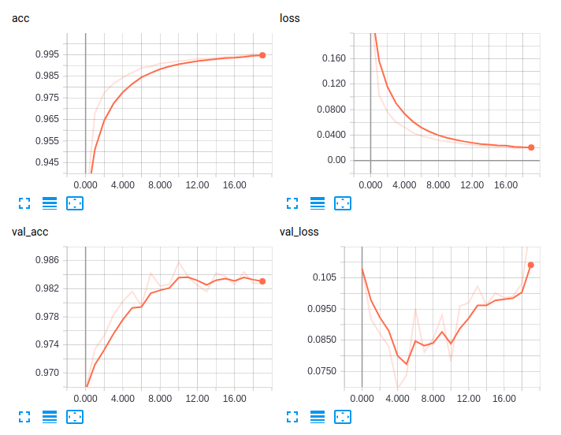
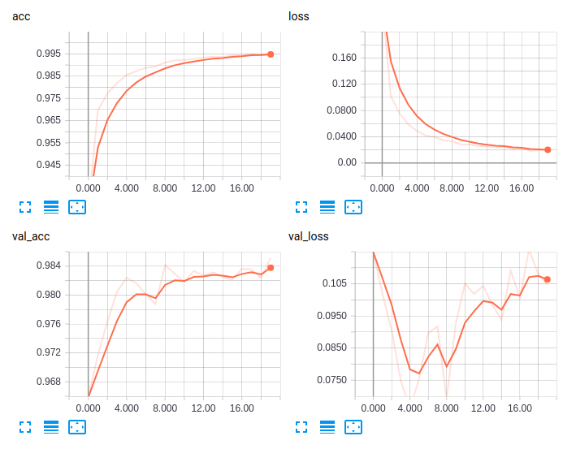
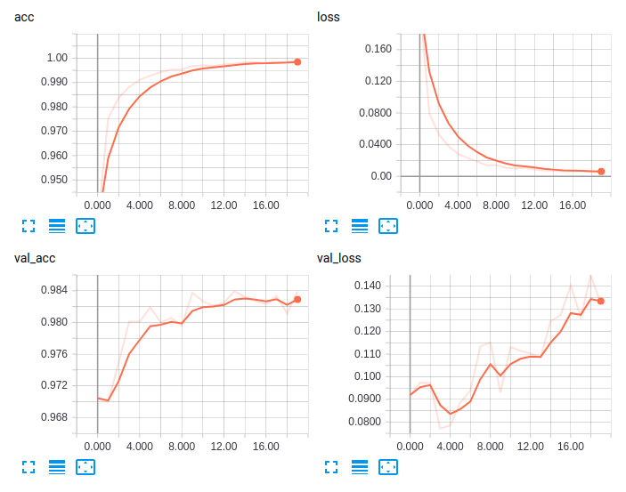
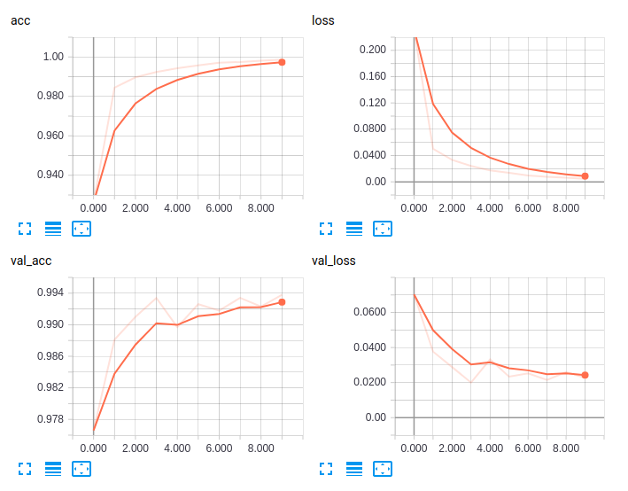
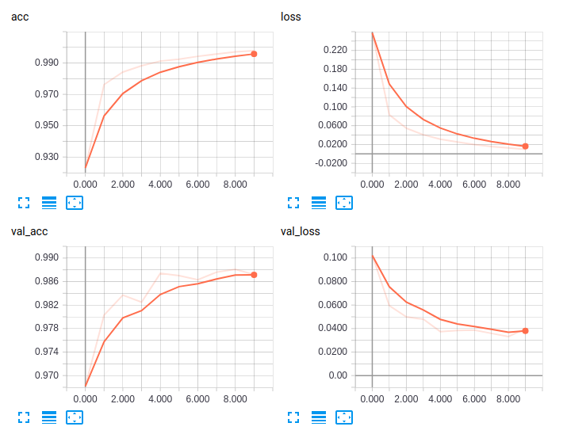

# neural-network-initiation

This project explores adding new classes to NN
and different configurations.

## Original
Train samples: 60000<br>
Validate samples: 10000

```
BATCH_SIZE = 128
NUM_CLASSES = 10
EPOCHS = 20
```

```
model = Sequential()
    model.add(Dense(512, activation='relu', input_shape=(784,)))
    model.add(Dropout(0.2))
    model.add(Dense(512, activation='relu'))
    model.add(Dropout(0.2))
    model.add(Dense(NUM_CLASSES, activation='softmax'))
```
```
_________________________________________________________________
Layer (type)                 Output Shape              Param #   
=================================================================
dense_1 (Dense)              (None, 512)               401920    
_________________________________________________________________
dropout_1 (Dropout)          (None, 512)               0         
_________________________________________________________________
dense_2 (Dense)              (None, 512)               262656    
_________________________________________________________________
dropout_2 (Dropout)          (None, 512)               0         
_________________________________________________________________
dense_3 (Dense)              (None, 10)                5130      
=================================================================
Total params: 669,706
```

Test loss: 0.12217565270982886<br/>
Test accuracy: 0.9827



## Extended
MNIST extended with letter "A" from NOT_MNIST.

Train samples: 61350<br>
Validate samples: 10450

```
BATCH_SIZE = 128
NUM_CLASSES = 10
EPOCHS = 20
```

```
    model = Sequential()
    model.add(Dense(512, activation='relu', input_shape=(784,)))
    model.add(Dropout(0.2))
    model.add(Dense(512, activation='relu'))
    model.add(Dropout(0.2))
    model.add(Dense(NUM_CLASSES, activation='softmax'))
```
```
_________________________________________________________________
Layer (type)                 Output Shape              Param #
=================================================================
dense_1 (Dense)              (None, 512)               401920
_________________________________________________________________
dropout_1 (Dropout)          (None, 512)               0
_________________________________________________________________
dense_2 (Dense)              (None, 512)               262656
_________________________________________________________________
dropout_2 (Dropout)          (None, 512)               0
_________________________________________________________________
dense_3 (Dense)              (None, 11)                5643
=================================================================
Total params: 670,219
```

Test loss: 0.10466432817719966<br/>
Test accuracy: 0.9851674641148326



### Configuration 1
Time: 20 x 4s

Removing Dropout layers<br>
Expecting: NN should start remembering images instead of recognising.


```
model = Sequential()
model.add(Dense(512, activation='relu', input_shape=(784,)))
# model.add(Dropout(0.2))
model.add(Dense(512, activation='relu'))
# model.add(Dropout(0.2))
model.add(Dense(NUM_CLASSES, activation='softmax'))
```

Test loss: 0.13202331797296807<br/>
Test accuracy: 0.9839234449760765



### Configuration 2
Time: 10 x 2m30s

Using convolutional network for the same task.<br>
Expecting:


```
BATCH_SIZE = 128
NUM_CLASSES = 10
EPOCHS = 10
```

```
model = Sequential()
model.add(Conv2D(filters=64, kernel_size=3, strides=1, \
        padding='same', activation='relu', \
        input_shape=[28, 28, 1]))
# 28*28*64
model.add(MaxPooling2D(pool_size=2, strides=2, padding='same'))
# 14*14*64

model.add(Conv2D(filters=128, kernel_size=3, strides=1, \
        padding='same', activation='relu'))
# 14*14*128
model.add(MaxPooling2D(pool_size=2, strides=2, padding='same'))
# 7*7*128

model.add(Conv2D(filters=256, kernel_size=3, strides=1, \
        padding='same', activation='relu'))
# 7*7*256
model.add(MaxPooling2D(pool_size=2, strides=2, padding='same'))
# 4*4*256

model.add(Flatten())
model.add(Dense(1024, activation='relu'))
#model.add(Dropout(0.5))
model.add(Dense(10, activation='softmax'))
```

Test loss: 0.0261<br/>
Test accuracy: 0.9928



### Configuration 3
Time: 10 x 1m40s

Reducing number of convolutional layers.<br>
Expecting:


```
BATCH_SIZE = 128
NUM_CLASSES = 10
EPOCHS = 10
```

```
model = Sequential()
model.add(Conv2D(filters=64, kernel_size=3, strides=1, \
        padding='same', activation='relu', \
        input_shape=[28, 28, 1]))
# 28*28*64
model.add(MaxPooling2D(pool_size=2, strides=2, padding='same'))
# 14*14*64

# model.add(Conv2D(filters=128, kernel_size=3, strides=1, \
#         padding='same', activation='relu'))
# # 14*14*128
# model.add(MaxPooling2D(pool_size=2, strides=2, padding='same'))
# # 7*7*128

# model.add(Conv2D(filters=256, kernel_size=3, strides=1, \
#         padding='same', activation='relu'))
# # 7*7*256
# model.add(MaxPooling2D(pool_size=2, strides=2, padding='same'))
# # 4*4*256

model.add(Flatten())
model.add(Dense(1024, activation='relu'))
#model.add(Dropout(0.5))
model.add(Dense(10, activation='softmax'))
```

Test loss: 0.0398<br/>
Test accuracy: 0.9872


